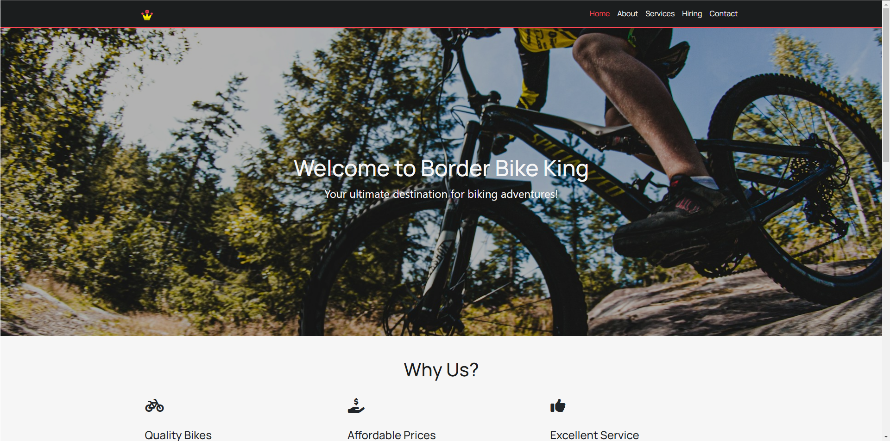

# Border Bike King

A responsive e-commerce website for a fictional bike shop built with HTML, CSS, JavaScript, and Bootstrap.

## Project Overview

Border Bike King was my end of year HNC Graded unit Piece. It uses Bootstrap CSS to create a responsive website. While the UI looks a bit dated in some areas, the main focus of this project was the JavaScript element we were required to implement.

I decided to create a JavaScript product sorting menu, which I believe is the standout feature of the website. I incorporated other multimedia elements such as a custom-made video component to create a more engaging user experience. While there are design choices I wouldn't replicate today, I'm proud of the technical implementation and problem-solving demonstrated in this project. 

## Development Notes

This project was developed as part of my HNC coursework, with specific requirements to demonstrate:

- Responsive design 
- Interactive JavaScript functionality (I chose to make a product sorting feature)
- Implementation of multimedia elements

The JavaScript product sorting feature allowed users to filter bike products based on various criteria, enhancing the shopping experience. 

## Future Plans

If I were to revisit this project, I would:

- Modernize the UI with a more contemporary & modern design approach, giving elements more white spacing and breathing room
- Implement a more sophisticated product filtering system
- Try and add more functionality to the website, maybe convert it to a full stack site and add in SQL databases

## Key Technologies

- HTML5
- CSS3 (Bootstrap framework)
- JavaScript
- Custom video implementation
- Responsive design
- Interactive product sorting
- Media queries for cross-device compatibility

## Live Demo

You can view the live project [here](http://webdev.edinburghcollege.ac.uk/HNCWEBMR11/BikeKingBorders/) or check out the code in the repository.

